Решение 1 (JADX)
Для начала скачиваем JADX 
После этого открываем прилагаемый к таску APK файл
И исследуем структуру проекта

Зачастую всё что нужно хранится в package ID в нашем случае это com -> KopohGames.Scheduler (com.KopohGames.Scheduler)
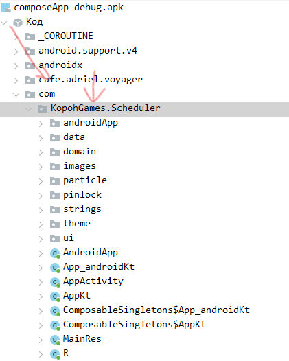
Изучая приложение мы находим файл TeacherLoginScreen
Находим в нем его ViewModel с названием TeacherLoginViewModel
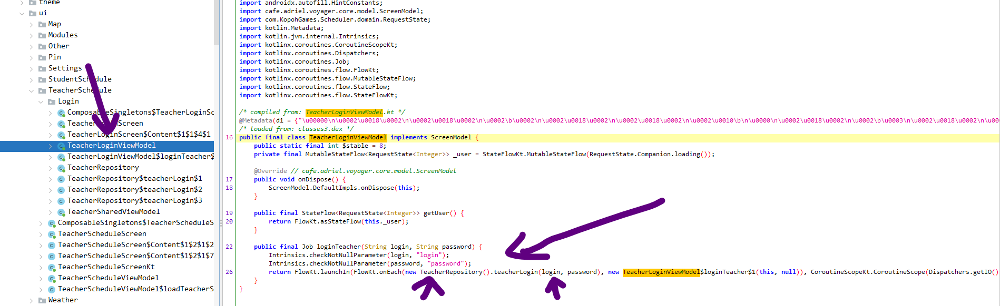
Видим обращение к файлу TeacherRepository
Дальше кликая по методу ==teacherLogin(login, password)== получаем ссылку на этот метод в котором спрятаны значения для входа
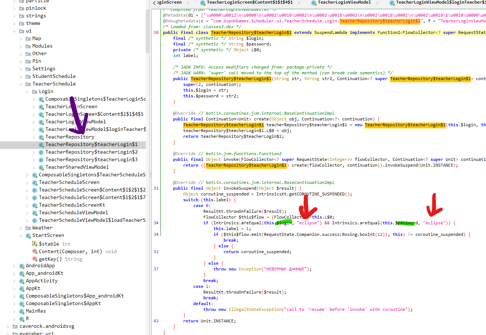
Перейдя в метод мы видим условное выражение if(login == "eclipse" && password == "eclipse")

Далее входим в приложение предварительно поставив в телефоне (эмуляторе) дату начала Redshift (18.12.2023)
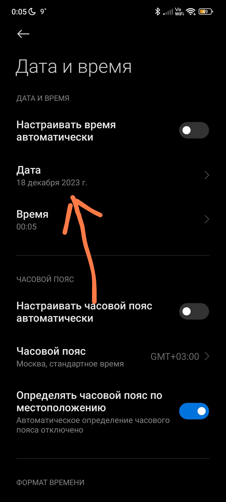
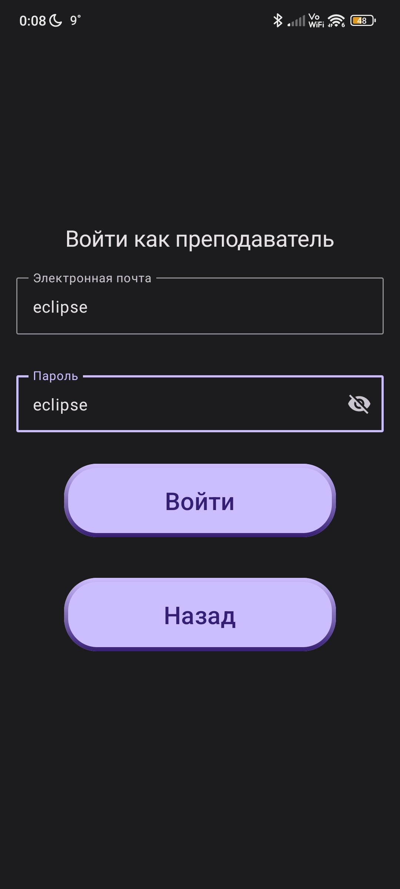


И по условию смотрим на страничку настроек где видим подсказку (что надо найти её в дискорде у пользователя kopoh)
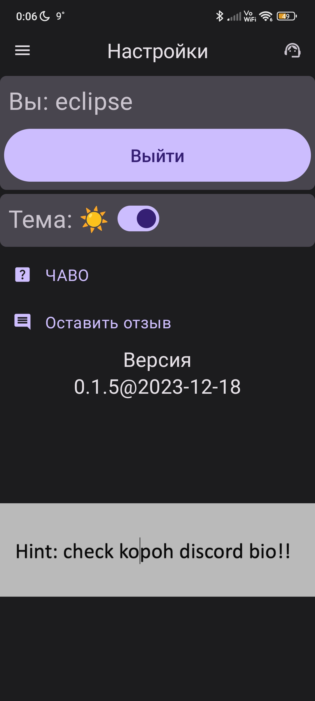

Или же на этапе исследования проекта найти картинку которая закопана глубоко в файлах
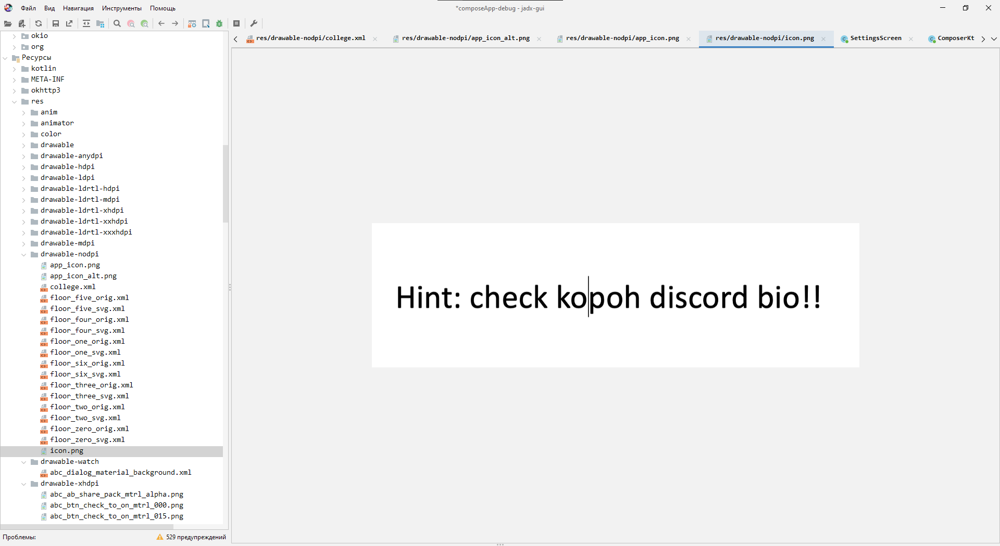
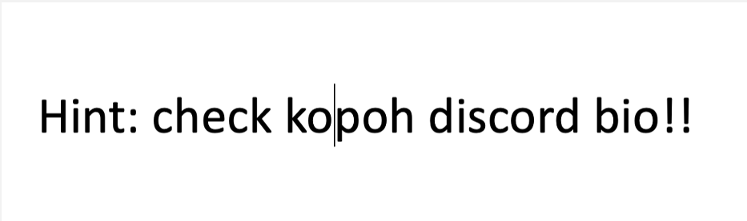

И флаг это 
```
eclipseCTF{k0po#_1S_U9V3R$}
```
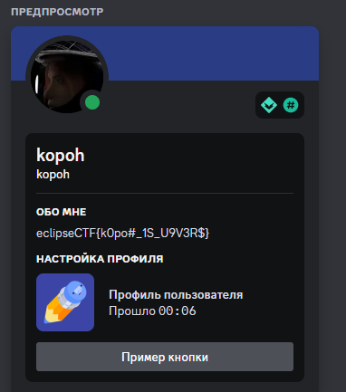

Решение 2 (BRUTFORCE)

Пробрутить значения email и password  :D

Решение 3 (IDA)

Открываем APK файл в ida64 как APK
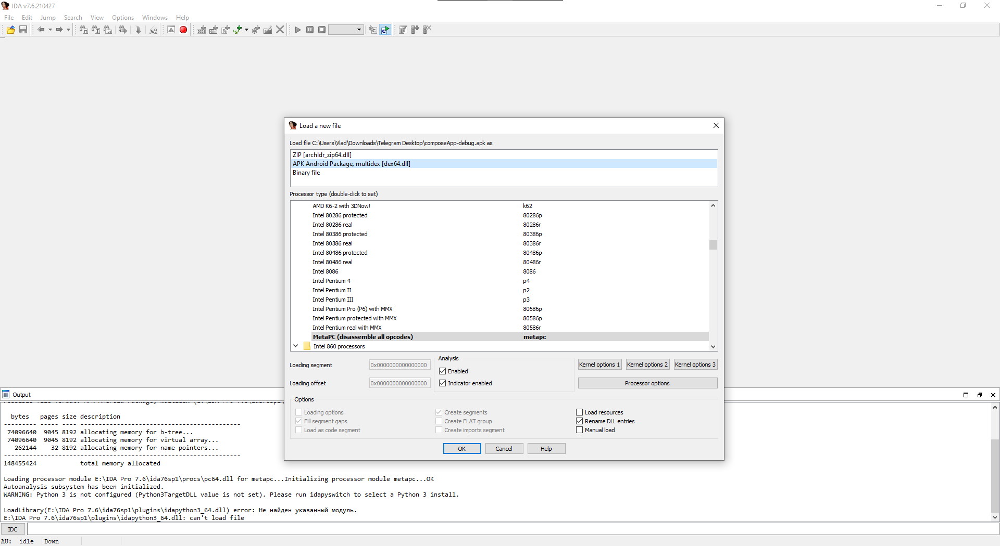

Дальше используем Strings для того чтобы собрать все строки в коде
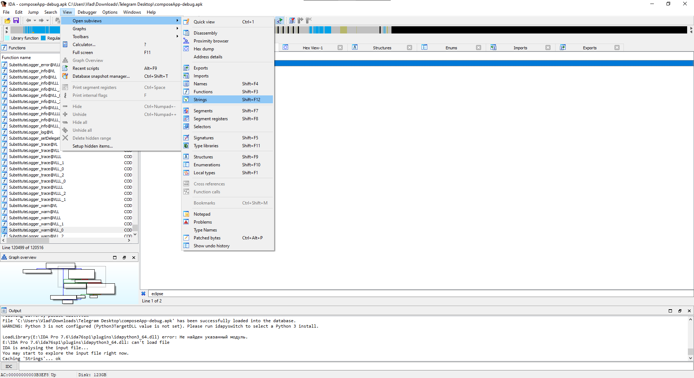
После этого ищем (поле/строку email или eclipse)
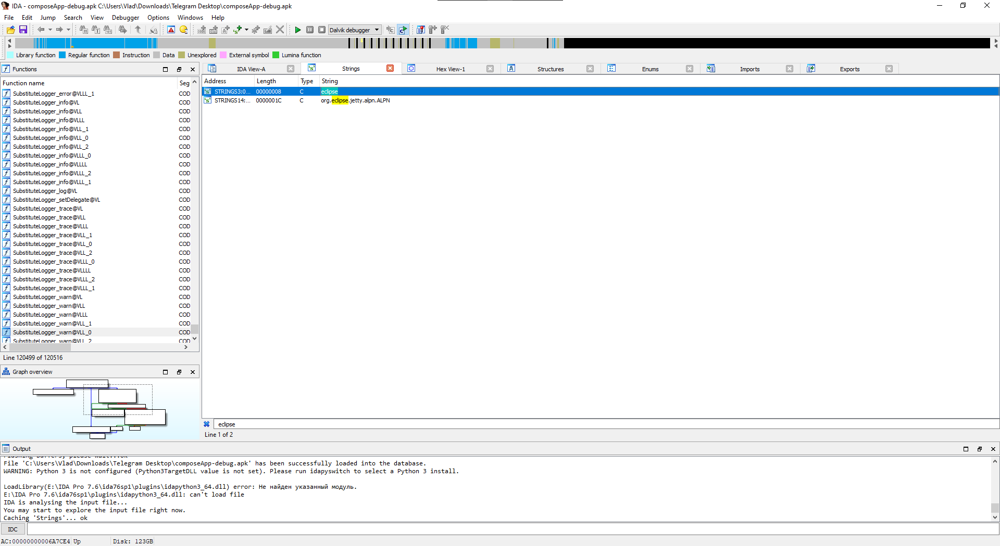
В итоге выходим на блок кода с условием if(email == "eclipse")
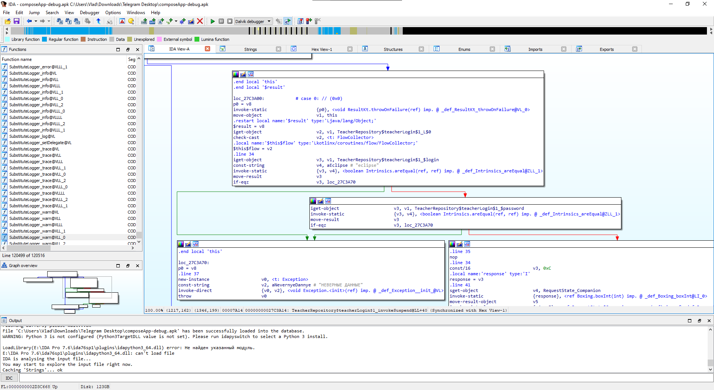

Далее вход в приложение с датой начала eclipse и поиск флага в дискорде


И флаг это
```
eclipseCTF{k0po#_1S_U9V3R$}
```

